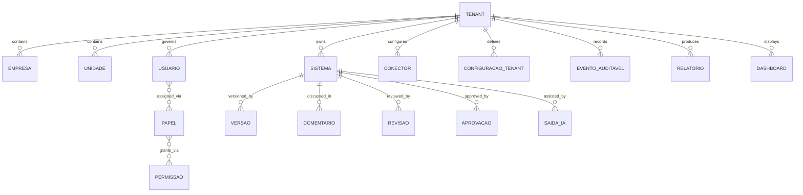
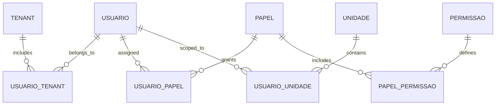
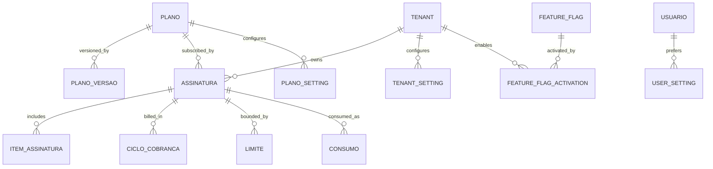
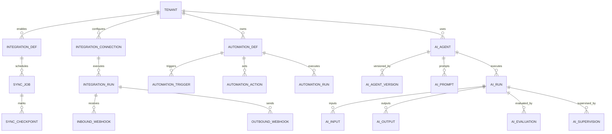
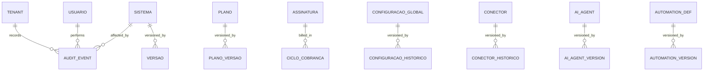

# DER — System Forge

## 1. Visão geral

O domínio de dados do System Forge organiza os conceitos necessários para representar criação, revisão, governança, colaboração, automação, integrações e observabilidade de sistemas em contexto enterprise.

### Objetivo do inventário

- Identificar candidatos a entidades e conceitos persistentes.
- Separar dados de negócio, eventos, configurações, atores e referências externas.
- Preservar rastreabilidade para orientar o DER.

### Fonte única

- `./docs/03.md`

## 2. Premissas de modelagem

### Premissas principais

| Premissa | Origem | Observação |
| --- | --- | --- |
| O modelo é multi-tenant | Seções 15, 16 e 17 de `03.md` | Todos os dados precisam carregar contexto de tenant quando aplicável |
| A revisão humana é parte do fluxo | Seções 13, 14, 15, 19 e 22 | Conteúdo sensível pode exigir estados adicionais |
| IA produz artefatos rastreáveis | Seções 14, 15, 19 e 21 | Saídas da IA precisam estar ligadas a versão e contexto |
| Auditoria é transversal | Seções 15, 16, 18, 19 e 24 | Eventos críticos devem ser registráveis e consultáveis |
| Configuração por escopo existe | Seções 16 e 17 | Dados de configuração precisam respeitar precedência |
| Integrações externas são candidatas de modelagem | Seções 18 e 24 | Origem externa precisa ser distinguível |
| Relatórios usam dados agregados | Seção 20 | Indicadores precisam de fonte e período |

### Lacunas de modelagem

- Não há modelagem final de banco físico.
- Não há definição de chaves técnicas, índices ou particionamento.
- Algumas regras candidatas ainda dependem de validação de produto.
- O nível ideal de granularidade por evento ainda é hipótese.

### Princípios

- Cada conceito deve ter origem rastreável em `03.md`.
- Dados de negócio e dados de operação devem ser separados conceitualmente.
- Estados devem ser modelados como parte do ciclo de vida.
- Configurações e permissões devem respeitar escopo.

## 3. Domínios de dados

### Domínio: Identidade, tenant e acesso

| Candidato | Tipo | Origem | Observação |
| --- | --- | --- | --- |
| Tenant | Entidade central | Seções 15, 16 e 17 | Isola contexto organizacional |
| Empresa | Estrutura organizacional | Seção 16 | Pode compor a hierarquia do tenant |
| Unidade / filial | Estrutura organizacional | Seção 16 | Subescopo operacional |
| Usuário | Atores do sistema | Seções 3, 15 e 16 | Pode atuar em múltiplos papéis |
| Papel | Autorização | Seção 16 | Define responsabilidade e acesso |
| Permissão | Autorização atômica | Seção 16 | Controla ações e escopo |
| Sessão | Ciclo de autenticação | Seção 21 | Suporta expiração e recuperação |

### Domínio: Núcleo do sistema

| Candidato | Tipo | Origem | Observação |
| --- | --- | --- | --- |
| Sistema | Entidade principal | Seções 1, 2, 4, 5 e 14 | Objeto central do produto |
| Versão | Entidade de histórico | Seções 14, 15, 19 e 22 | Preserva evolução |
| Revisão | Evento / estado | Seções 13, 14, 15 e 22 | Pode exigir aprovação |
| Aprovação | Evento / estado | Seções 13, 15, 16 e 22 | Formaliza aceite |
| Contexto do sistema | Agrupamento de dados | Seções 13, 14, 19 e 24 | Base para IA e rastreabilidade |
| Estado do sistema | Atributo / lifecycle | Seções 21 e 22 | Inclui loading, validation, conflict etc. |

### Domínio: Colaboração e fluxo

| Candidato | Tipo | Origem | Observação |
| --- | --- | --- | --- |
| Comentário | Evento de colaboração | Seções 13, 14 e 15 | Deve permanecer contextual |
| Menção | Evento de colaboração | Seção 13 | Aciona participação |
| Convite | Evento de colaboração | Seção 13 | Conecta atores ao fluxo |
| Histórico colaborativo | Registro agregado | Seção 13 | Preserva interações |
| Fila de revisão | Estrutura operacional | Seções 19 e 20 | Suporta pendências |

### Domínio: IA e automação

| Candidato | Tipo | Origem | Observação |
| --- | --- | --- | --- |
| Solicitação de IA | Evento | Seção 19 | Pedido contextual |
| Saída de IA | Artefato / resposta | Seções 19 e 21 | Deve ser rastreável |
| Explicação da IA | Metadado / justificativa | Seção 19 | Suporta confiança |
| Automação | Regra operacional | Seção 19 | Pode ser determinística |
| Tarefa automatizada | Evento / job conceitual | Seção 19 | Pode ser monitorada |

### Domínio: Integrações e dados externos

| Candidato | Tipo | Origem | Observação |
| --- | --- | --- | --- |
| Conector | Integração | Seção 18 | Representa vínculo com serviço externo |
| Credencial / autorização | Segurança | Seção 18 | Base para autenticação |
| Payload de evento | Dados externos | Seção 18 | Suporta webhooks e sync |
| Importação | Processo / evento | Seção 18 | Preserva rastreabilidade mínima |
| Exportação | Processo / evento | Seção 18 | Pode ser limitada por política |

### Domínio: Configuração, billing e plano

| Candidato | Tipo | Origem | Observação |
| --- | --- | --- | --- |
| Configuração global | Configuração | Seção 17 | Base de precedência |
| Configuração de plano | Configuração | Seção 17 | Controla limites e pacote |
| Configuração de tenant | Configuração | Seção 17 | Ajusta políticas locais |
| Preferência de usuário | Configuração pessoal | Seção 17 | Afeta UX |
| Limite de uso | Métrica de plano | Seção 17 | Pode influenciar billing |
| Quota de integração | Métrica de plano | Seção 17 | Pode influenciar billing |
| Plano / pacote | Entidade comercial | Seção 17 e 25 | Necessário para limites e acesso |

### Domínio: Observabilidade, auditoria e relatórios

| Candidato | Tipo | Origem | Observação |
| --- | --- | --- | --- |
| Evento auditável | Evento | Seções 15, 19, 20 e 24 | Base da trilha |
| Log | Registro operacional | Seções 15 e 20 | Imutável após gravação |
| Trilha de auditoria | Histórico | Seções 15, 19 e 24 | Contextualiza ações |
| Indicador | Métrica | Seção 20 | Deve ter fonte |
| Relatório | Agregação | Seção 20 | Suporta decisão |
| Dashboard | Visualização agregada | Seção 20 | Não substitui auditoria |

### Domínio: Estados e feedbacks

| Candidato | Tipo | Origem | Observação |
| --- | --- | --- | --- |
| Loading | Estado global | Seção 21 | Feedback de espera |
| Empty | Estado global | Seção 21 | Sem conteúdo |
| Error | Estado global | Seção 21 | Recuperação necessária |
| No permission | Estado global | Seção 21 | Bloqueio por acesso |
| Validation | Estado global | Seção 21 | Regras pendentes |
| Conflict | Estado global | Seção 21 | Conflito de versão |
| Offline | Estado global | Seção 21 | Conectividade ausente |
| Plan limit reached | Estado global | Seção 21 | Limite comercial |
| Session expired | Estado global | Seção 21 | Reautenticação |
| Integration unavailable | Estado global | Seção 21 | Serviço indisponível |
| Awaiting approval | Estado global | Seções 19, 21 e 22 | Fluxo pendente |

### Domínio: Lacunas de modelagem

| Candidato | Tipo | Origem | Observação |
| --- | --- | --- | --- |
| Estrutura fina de billing | Premissa | Seções 17, 18 e 25 | Ainda não detalhada |
| Granularidade ideal de eventos | Premissa | Seções 15, 19, 20 e 24 | Depende do uso real |
| Modelo final de entidades de IA | Premissa | Seção 19 | Pode variar por implementação |
| Regras finais de aprovação | Premissa | Seções 15, 16, 21 e 22 | Ainda dependente de validação |

### Síntese

- O núcleo do domínio de dados é composto por tenant, sistema, versões, regras de acesso, estados, IA, integrações e auditoria.
- As lacunas restantes são de granularidade e validação, não de tese de domínio.
- Elementos puramente visuais foram excluídos deliberadamente.

## 4. Diagrama ER em Mermaid

### Chaves lógicas candidatas

| Entidade | PK candidata | Observação |
| --- | --- | --- |
| Tenant | tenant_id | Estável no escopo organizacional |
| Empresa | empresa_id | Pode ser única dentro do tenant |
| Unidade / filial | unidade_id | Depende da hierarquia do tenant |
| Usuário | user_id | Identificador estável de identidade |
| Papel | role_id | Reutilizável por tenant ou global |
| Permissão | permission_id | Representa ação atômica |
| Sistema | system_id | Núcleo do produto |
| Versão | version_id | Histórico por sistema |
| Comentário | comment_id | Entidade de feedback contextual |
| Revisão | review_id | Evento de validação |
| Aprovação | approval_id | Evento de aceite |
| Conector | connector_id | Integração externa |
| Configuração de tenant | tenant_setting_id | Parâmetro por escopo |
| Evento auditável | audit_event_id | Registro imutável |
| Relatório | report_id | Agregação lógica |
| Dashboard | dashboard_id | Visualização agregada |

### Relacionamentos principais

| Origem | Destino | Cardinalidade | Tipo | Observação |
| --- | --- | --- | --- | --- |
| Tenant | Empresa | 1:N | Hierárquico | Empresa pertence a um tenant |
| Tenant | Unidade / filial | 1:N | Hierárquico | Unidade pertence ao tenant via empresa ou matriz |
| Tenant | Usuário | 1:N | Contextual | Usuário pode existir em múltiplos tenants por vínculo |
| Usuário | Papel | N:N | Associativa | Resolvido por Usuário-Papel |
| Papel | Permissão | N:N | Associativa | Resolvido por Papel-Permissão |
| Tenant | Sistema | 1:N | Contextual | Sistema pertence ao tenant |
| Sistema | Versão | 1:N | Histórico | Versionamento sequencial |
| Sistema | Comentário | 1:N | Colaboração | Feedback contextual |
| Sistema | Revisão | 1:N | Fluxo | Pode haver múltiplas revisões |
| Sistema | Aprovação | 1:N | Fluxo | Pode haver múltiplas aprovações |
| Sistema | Saída de IA | 1:N | Operacional | Registra assistências |
| Sistema | Evento auditável | 1:N | Observabilidade | Eventos sensíveis e operacionais |
| Tenant | Conector | 1:N | Integração | Conectores isolados por contexto |
| Tenant | Configuração de tenant | 1:N | Configuração | Política por organização |
| Tenant | Relatório | 1:N | Analítico | Relatórios por organização |
| Tenant | Dashboard | 1:N | Analítico | Visualizações por contexto |

### Relações N:N normalizadas

| Relação N:N | Entidade associativa | Justificativa |
| --- | --- | --- |
| Usuário x Papel | Usuário-Papel | Um usuário pode acumular papéis |
| Papel x Permissão | Papel-Permissão | Matriz de acesso flexível |
| Sistema x Conector | Sistema-Conector | Integrações podem variar por sistema |
| Sistema x Usuário | Sistema-Participação | Múltiplos atores por sistema |
| Sistema x Evento auditável | Sistema-Auditoria | Necessária rastreabilidade contextual |
| Tenant x Usuário | Tenant-Participação | Usuário pode atuar em mais de um tenant |

### Atributos derivados

| Atributo derivado | Base | Observação |
| --- | --- | --- |
| Status consolidado do sistema | Revisões, aprovações e versões | Não deve ser persistido sem motivo |
| Contagem de versões | Versões | Pode ser calculada |
| Tempo em revisão | Revisão e timestamps | Indicador derivado |
| Uso por período | Eventos e logs | Base para relatório |
| Percentual aprovado sem retrabalho | Revisão e aprovação | Métrica calculada |

### Regras de normalização

- Dados repetitivos foram separados em entidades próprias quando carregam identidade.
- Estados globais não devem ser duplicados como texto solto dentro de outras entidades.
- Configuração por escopo deve permanecer associada ao contexto correto.
- Eventos auditáveis devem ser independentes de relatórios agregados.
- Conteúdo flexível externo pode ser armazenado como payload, mas somente quando não for essencial ao domínio central.

### Mermaid conceitual

### Mermaid consolidado

```mermaid
erDiagram
    TENANT {
        string tenant_id PK
        string name
        string status
    }
    EMPRESA {
        string empresa_id PK
        string tenant_id FK
        string name
        string status
    }
    UNIDADE {
        string unidade_id PK
        string tenant_id FK
        string empresa_id FK
        string name
        string status
    }
    USUARIO {
        string user_id PK
        string tenant_id FK
        string name
        string email
        string status
    }
    PAPEL {
        string role_id PK
        string tenant_id FK
        string name
        string status
    }
    PERMISSAO {
        string permission_id PK
        string code
        string name
    }
    USUARIO_TENANT {
        string user_tenant_id PK
        string user_id FK
        string tenant_id FK
        string status
    }
    USUARIO_PAPEL {
        string user_role_id PK
        string user_id FK
        string role_id FK
        string tenant_id FK
    }
    PAPEL_PERMISSAO {
        string role_permission_id PK
        string role_id FK
        string permission_id FK
    }
    USUARIO_UNIDADE {
        string user_unit_id PK
        string user_id FK
        string unidade_id FK
    }
    SISTEMA {
        string system_id PK
        string tenant_id FK
        string title
        string status
    }
    VERSAO {
        string version_id PK
        string system_id FK
        string version_number
        string status
    }
    COMENTARIO {
        string comment_id PK
        string system_id FK
        string user_id FK
        string tenant_id FK
        string content
    }
    REVISAO {
        string review_id PK
        string system_id FK
        string user_id FK
        string status
    }
    APROVACAO {
        string approval_id PK
        string system_id FK
        string user_id FK
        string status
    }
    CONECTOR {
        string connector_id PK
        string tenant_id FK
        string code
        string status
    }
    TENANT_SETTING {
        string tenant_setting_id PK
        string tenant_id FK
        string key
        string value
        string scope
    }
    PLANO {
        string plan_id PK
        string name
        string status
    }
    PLANO_VERSAO {
        string plan_version_id PK
        string plan_id FK
        string version_number
        string status
    }
    ASSINATURA {
        string subscription_id PK
        string tenant_id FK
        string plan_id FK
        string status
    }
    ITEM_ASSINATURA {
        string subscription_item_id PK
        string subscription_id FK
        string code
    }
    CICLO_COBRANCA {
        string billing_cycle_id PK
        string subscription_id FK
        string starts_at
        string ends_at
    }
    LIMITE {
        string limit_id PK
        string subscription_id FK
        string code
        string value
    }
    CONSUMO {
        string usage_id PK
        string subscription_id FK
        string code
        string value
        string measured_at
    }
    FEATURE_FLAG {
        string feature_flag_id PK
        string code
        string description
        string status
    }
    FEATURE_FLAG_ACTIVATION {
        string flag_activation_id PK
        string feature_flag_id FK
        string tenant_id FK
        string scope
        string status
    }
    EVENTO_AUDITAVEL {
        string audit_event_id PK
        string tenant_id FK
        string user_id FK
        string action
        string target
        string correlation_id
    }
    RELATORIO {
        string report_id PK
        string tenant_id FK
        string code
    }
    DASHBOARD {
        string dashboard_id PK
        string tenant_id FK
        string code
    }
    INTEGRATION_DEF {
        string integration_def_id PK
        string code
        string status
    }
    INTEGRATION_CONNECTION {
        string integration_connection_id PK
        string tenant_id FK
        string integration_def_id FK
        string status
    }
    INTEGRATION_RUN {
        string integration_run_id PK
        string integration_connection_id FK
        string status
        string correlation_id
    }
    INBOUND_WEBHOOK {
        string inbound_webhook_id PK
        string integration_run_id FK
        string payload
    }
    OUTBOUND_WEBHOOK {
        string outbound_webhook_id PK
        string integration_run_id FK
        string payload
    }
    SYNC_JOB {
        string sync_job_id PK
        string integration_def_id FK
        string status
    }
    SYNC_CHECKPOINT {
        string sync_checkpoint_id PK
        string sync_job_id FK
        string checkpoint_at
    }
    AUTOMATION_DEF {
        string automation_def_id PK
        string tenant_id FK
        string code
        string status
    }
    AUTOMATION_TRIGGER {
        string automation_trigger_id PK
        string automation_def_id FK
        string trigger_type
    }
    AUTOMATION_ACTION {
        string automation_action_id PK
        string automation_def_id FK
        string action_type
    }
    AUTOMATION_RUN {
        string automation_run_id PK
        string automation_def_id FK
        string status
    }
    AI_AGENT {
        string ai_agent_id PK
        string tenant_id FK
        string code
        string status
    }
    AI_AGENT_VERSION {
        string ai_agent_version_id PK
        string ai_agent_id FK
        string version_number
        string status
    }
    AI_PROMPT {
        string ai_prompt_id PK
        string ai_agent_id FK
        string content
    }
    AI_RUN {
        string ai_run_id PK
        string ai_agent_id FK
        string system_id FK
        string user_id FK
        string status
    }
    AI_INPUT {
        string ai_input_id PK
        string ai_run_id FK
        string payload
    }
    AI_OUTPUT {
        string ai_output_id PK
        string ai_run_id FK
        string payload
    }
    AI_EVALUATION {
        string ai_evaluation_id PK
        string ai_run_id FK
        string score
        string status
    }
    AI_SUPERVISION {
        string ai_supervision_id PK
        string ai_run_id FK
        string user_id FK
        string status
    }
    AUDIT_EVENT {
        string audit_event_id PK
        string tenant_id FK
        string user_id FK
        string action
        string target
        string correlation_id
    }
    CONFIGURACAO_GLOBAL {
        string global_setting_id PK
        string key
        string value
    }
    CONFIGURACAO_HISTORICO {
        string configuration_history_id PK
        string config_id FK
        string version_number
        string status
    }
    CONFIGURACAO {
        string config_id PK
        string scope
        string key
        string value
        string status
    }
    CONECTOR_HISTORICO {
        string connector_history_id PK
        string connector_id FK
        string version_number
        string status
    }

    TENANT ||--o{ EMPRESA : contains
    TENANT ||--o{ UNIDADE : contains
    TENANT ||--o{ USUARIO : governs
    TENANT ||--o{ USUARIO_TENANT : includes
    USUARIO ||--o{ USUARIO_TENANT : belongs_to
    USUARIO ||--o{ USUARIO_PAPEL : assigned
    PAPEL ||--o{ USUARIO_PAPEL : grants
    PAPEL ||--o{ PAPEL_PERMISSAO : includes
    PERMISSAO ||--o{ PAPEL_PERMISSAO : defines
    USUARIO ||--o{ USUARIO_UNIDADE : scoped_to
    UNIDADE ||--o{ USUARIO_UNIDADE : contains
    TENANT ||--o{ PAPEL : owns
    TENANT ||--o{ SISTEMA : owns
    SISTEMA ||--o{ VERSAO : versioned_by
    SISTEMA ||--o{ COMENTARIO : discussed_in
    SISTEMA ||--o{ REVISAO : reviewed_by
    SISTEMA ||--o{ APROVACAO : approved_by
    SISTEMA ||--o{ AI_RUN : assisted_by
    TENANT ||--o{ CONECTOR : configures
    TENANT ||--o{ TENANT_SETTING : defines
    TENANT ||--o{ RELATORIO : produces
    TENANT ||--o{ DASHBOARD : displays
    TENANT ||--o{ ASSINATURA : owns
    PLANO ||--o{ PLANO_VERSAO : versioned_by
    PLANO ||--o{ ASSINATURA : subscribed_by
    ASSINATURA ||--o{ ITEM_ASSINATURA : includes
    ASSINATURA ||--o{ CICLO_COBRANCA : billed_in
    ASSINATURA ||--o{ LIMITE : bounded_by
    ASSINATURA ||--o{ CONSUMO : consumed_as
    FEATURE_FLAG ||--o{ FEATURE_FLAG_ACTIVATION : activated_by
    TENANT ||--o{ FEATURE_FLAG_ACTIVATION : enables
    TENANT ||--o{ EVENTO_AUDITAVEL : records
    TENANT ||--o{ AUDIT_EVENT : records
    CONECTOR ||--o{ CONECTOR_HISTORICO : versioned_by
    INTEGRATION_DEF ||--o{ INTEGRATION_CONNECTION : configured_by
    INTEGRATION_CONNECTION ||--o{ INTEGRATION_RUN : executes
    INTEGRATION_RUN ||--o{ INBOUND_WEBHOOK : receives
    INTEGRATION_RUN ||--o{ OUTBOUND_WEBHOOK : sends
    INTEGRATION_DEF ||--o{ SYNC_JOB : schedules
    SYNC_JOB ||--o{ SYNC_CHECKPOINT : marks
    TENANT ||--o{ AUTOMATION_DEF : owns
    AUTOMATION_DEF ||--o{ AUTOMATION_TRIGGER : triggers
    AUTOMATION_DEF ||--o{ AUTOMATION_ACTION : acts
    AUTOMATION_DEF ||--o{ AUTOMATION_RUN : executes
    TENANT ||--o{ AI_AGENT : uses
    AI_AGENT ||--o{ AI_AGENT_VERSION : versioned_by
    AI_AGENT ||--o{ AI_PROMPT : prompts
    AI_AGENT ||--o{ AI_RUN : executes
    AI_RUN ||--o{ AI_INPUT : inputs
    AI_RUN ||--o{ AI_OUTPUT : outputs
    AI_RUN ||--o{ AI_EVALUATION : evaluated_by
    AI_RUN ||--o{ AI_SUPERVISION : supervised_by
    CONFIGURACAO ||--o{ CONFIGURACAO_HISTORICO : versioned_by
```

### Observação

- O Mermaid acima é conceitual e não define modelagem física.
- As entidades associativas podem se desdobrar conforme a validação do produto.
- A granularidade final ainda depende da etapa de arquitetura de dados.

## 5. Dicionário resumido de entidades

### Entidades principais

| Entidade | Domínio | Finalidade | Ciclo de vida | Origem |
| --- | --- | --- | --- | --- |
| Tenant | Identidade, tenant e acesso | Isolar e governar a organização | Ativo, suspenso, inativo | Seções 15, 16 e 17 |
| Empresa | Identidade, tenant e acesso | Representar estrutura corporativa | Ativa, inativa | Seção 16 |
| Unidade / filial | Identidade, tenant e acesso | Representar subescopo operacional | Ativa, inativa | Seção 16 |
| Usuário | Identidade, tenant e acesso | Ator autenticado do sistema | Ativo, suspenso, desativado | Seções 3, 15 e 16 |
| Papel | Identidade, tenant e acesso | Agrupar responsabilidades | Ativo, desativado | Seção 16 |
| Permissão | Identidade, tenant e acesso | Autorizar ações | Ativa, revogada | Seção 16 |
| Sistema | Núcleo do sistema | Objeto central de criação e revisão | Rascunho, em revisão, aprovado, arquivado | Seções 1, 2, 4, 5 e 14 |
| Versão | Núcleo do sistema | Registrar evolução do sistema | Criada, consolidada, substituída | Seções 14, 15, 19 e 22 |
| Plano / pacote | Configuração, billing e plano | Controlar acesso e limites | Ativo, expirado, suspenso | Seção 17 e 25 |

### Entidades associativas

| Entidade associativa | Relaciona | Finalidade | Origem |
| --- | --- | --- | --- |
| Usuário-Papel | Usuário x Papel | Permitir múltiplos papéis por usuário | Seção 16 |
| Papel-Permissão | Papel x Permissão | Representar matriz de acesso | Seção 16 |
| Sistema-Versão | Sistema x Versão | Preservar histórico de alterações | Seções 14, 15 e 22 |
| Sistema-Tenant | Sistema x Tenant | Garantir isolamento multitenant | Seções 15 e 16 |
| Sistema-Comentário | Sistema x Comentário | Manter feedback contextual | Seções 13, 14 e 15 |
| Sistema-Revisão | Sistema x Revisão | Registrar validação do conteúdo | Seções 14, 15 e 22 |
| Sistema-Aprovação | Sistema x Aprovação | Formalizar aceite | Seções 15, 16 e 22 |
| Sistema-IA | Sistema x Saída de IA | Rastrear uso de assistência | Seções 19 e 21 |
| Tenant-Conector | Tenant x Conector | Isolar integrações por contexto | Seção 18 |
| Tenant-Configuração | Tenant x Configuração de tenant | Guardar políticas locais | Seção 17 |

### Atributos candidatos

| Atributo | Pertence a | Tipo | Observação |
| --- | --- | --- | --- |
| Nome | Tenant, Empresa, Sistema, Plano | Texto | Identificação humana |
| Código | Tenant, Sistema, Conector | Texto / identificador | Pode ser único por escopo |
| Status | Sistema, Versão, Usuário, Conector | Enum | Depende do ciclo de vida |
| Escopo | Permissão, Configuração, Papel | Enum | Global, tenant, empresa etc. |
| Prioridade | Funcionalidade, tarefa, risco | Enum | Essencial, importante, avançado... |
| Origem | Entidade candidata | Texto estruturado | Seção de proveniência |
| Timestamp | Evento, log, trilha | Data/hora | Requer rastreabilidade |
| Conteúdo | Sistema, Versão, Comentário, Saída de IA | Texto / estrutura | Dados centrais do produto |
| Motivo | Aprovação, revisão, conflito | Texto | Explicação de decisão |
| Resultado | Regras, eventos, automações | Texto / enum | Situação final |

### Valores enumerados candidatos

| Enum | Valores candidatos | Origem |
| --- | --- | --- |
| Status do sistema | rascunho, em revisão, aprovado, arquivado, rejeitado | Seções 14, 15 e 22 |
| Status da versão | criada, consolidada, substituída | Seções 14 e 15 |
| Estado global | loading, empty, error, no permission, success, validation, conflict, offline, plan limit reached, session expired, integration unavailable, awaiting approval | Seção 21 |
| Tipo de prioridade | essencial, importante, avançado, futuro, experimental, dependente de validação | Seções 10, 14 e 23 |
| Escopo | global, tenant, empresa, matriz, filial, unidade, próprio registro, leitura | Seções 16 e 17 |
| Tipo de risco | funcional, integração, IA, segurança, compliance, operação, governança | Seções 25 e 29 |

### Eventos e registros

| Evento / registro | Domínio | Finalidade | Origem |
| --- | --- | --- | --- |
| Criação de sistema | Núcleo do sistema | Iniciar ciclo de vida | Seções 14 e 15 |
| Revisão de sistema | Núcleo do sistema | Validar conteúdo | Seções 14, 15 e 22 |
| Aprovação de etapa | Colaboração e fluxo | Formalizar decisão | Seções 15, 16 e 22 |
| Alteração de versão | Núcleo do sistema | Preservar histórico | Seções 14, 15 e 22 |
| Evento auditável | Observabilidade | Registrar ação sensível | Seções 15, 19, 20 e 24 |
| Ação de IA | IA e automação | Rastrear assistência | Seção 19 |
| Sincronização de integração | Integrações | Registrar troca de dados | Seção 18 |
| Mudança de configuração | Configuração | Controlar precedência e impacto | Seção 17 |

### Documentos externos e artefatos

| Documento / artefato | Tipo | Finalidade | Origem |
| --- | --- | --- | --- |
| Relatório | Agregação | Apoiar decisão | Seção 20 |
| Dashboard | Visualização agregada | Monitorar operação e risco | Seção 20 |
| Saída de IA | Artefato | Apoiar criação e revisão | Seção 19 |
| Payload externo | Documento / mensagem | Receber ou enviar dados | Seção 18 |
| Explicação da IA | Metadado narrativo | Justificar saída | Seção 19 |

### Sinônimos consolidados

- Sistema e objeto principal do produto são tratados como a mesma entidade central.
- Revisão assistida e revisão de sistema pertencem ao mesmo eixo de validação.
- Comentário contextual e comentário em contexto são o mesmo conceito funcional.
- Conector e integração externa representam o mesmo vínculo com serviços de fora.
- Trilha de auditoria, logs e eventos auditáveis são conceitos relacionados, mas com granularidade distinta.

### Itens rejeitados

- Tela.
- Botão.
- Filtro.
- Card.
- Componente visual.
- Layout.

### Síntese do dicionário

- As entidades principais estão concentradas em identidade, núcleo do sistema, configurações, automação, integração e observabilidade.
- Entidades associativas resolvem relações N:N relevantes.
- Atributos, enums e eventos foram separados para evitar duplicidade semântica.
- Itens puramente visuais foram excluídos de forma explícita.

## 6. Decisões de modelagem

### Decisões consolidadas

| Decisão | Justificativa | Impacto |
| --- | --- | --- |
| Tenant é a fronteira primária de isolamento | Requisito central de multi-tenant e governança | Simplifica segurança e consultas |
| Empresa, matriz, filial e unidade são subescopos organizacionais | Acesso e operação variam por contexto | Evita ambiguidade entre níveis |
| Entidades operacionais carregam tenant_id | Garante isolamento por contexto | Facilita rastreabilidade e autorização |
| Papéis e permissões são separados | Reduz duplicação e melhora a matriz de acesso | Suporta menor privilégio |
| Estados globais não são atributos livres em entidades de negócio | Evita confusão entre lifecycle e conteúdo | Melhora consistência do domínio |
| Comentários, revisões e aprovações são eventos/associações e não texto solto | Mantém trilha e contexto | Ajuda auditoria e colaboração |
| IA gera saídas rastreáveis vinculadas ao sistema | Necessário para confiança e auditabilidade | Liga assistência ao fluxo |
| Relatórios e dashboards são derivados, não fonte primária | Evita duplicação com eventos base | Mantém integridade analítica |

### Escopos organizacionais

| Nível | Relação com tenant | Observação |
| --- | --- | --- |
| Global | Acima do tenant | Aplicável à plataforma |
| Tenant | Fronteira de isolamento | Unidade principal de governança |
| Empresa | Dentro do tenant | Contexto corporativo |
| Matriz | Dentro do tenant | Agrupamento principal |
| Filial / unidade | Dentro do tenant | Subescopo operacional |
| Próprio registro | Dentro do usuário/papel | Acesso individual |

### Decisão sobre isolamento

- O modelo deve suportar isolamento por tenant de forma nativa.
- O desenho conceitual deve permitir isolamento por linha quando necessário, sem detalhar SQL.
- Configurações e integrações também devem respeitar a fronteira do tenant.

### Dependências de modelagem

- Tenant depende de identidade e acesso.
- Sistema depende de tenant, versões, revisões e aprovações.
- Observabilidade depende de eventos auditáveis.
- Integrações dependem de conector, credencial e escopo.

### Observação

- A etapa ainda não define tabelas físicas, constraints, índices ou políticas de banco.
- O objetivo aqui é garantir coerência lógica e fronteiras claras.

## 7. Identidade e autorização

### Entidades de identidade

| Entidade | Função | Domínio | PK candidata | Origem |
| --- | --- | --- | --- | --- |
| Usuário | Identidade autenticável | Identidade, tenant e acesso | user_id | Seções 15 e 16 |
| Tenant | Fronteira organizacional | Identidade, tenant e acesso | tenant_id | Seções 15, 16 e 17 |
| Associação usuário-tenant | Vínculo de acesso | Identidade e autorização | user_tenant_id | Seção 16 |
| Papel | Grupo de responsabilidade | Identidade e autorização | role_id | Seção 16 |
| Permissão | Ação autorizável | Identidade e autorização | permission_id | Seção 16 |

### Entidades associativas de autorização

| Entidade associativa | Relaciona | Finalidade | PK candidata | Origem |
| --- | --- | --- | --- | --- |
| Usuário-Papel | Usuário x Papel | Atribuir papéis ao usuário | user_role_id | Seção 16 |
| Papel-Permissão | Papel x Permissão | Conceder ações por papel | role_permission_id | Seção 16 |
| Usuário-Tenant | Usuário x Tenant | Vincular usuário ao tenant | user_tenant_id | Seção 16 |
| Usuário-Unidade | Usuário x Unidade | Restringir operação por unidade | user_unit_id | Seção 16 |

### Escopo de concessão

| Escopo | Significado | Uso |
| --- | --- | --- |
| Global | Aplica-se à plataforma | Superadmin e políticas centrais |
| Tenant | Aplica-se à organização | Admin de tenant e políticas locais |
| Empresa | Aplica-se à empresa interna | Restrições de operação |
| Matriz | Aplica-se ao núcleo organizacional | Regras centrais dentro do tenant |
| Filial / unidade | Aplica-se ao subcontexto | Operação local |
| Próprio registro | Aplica-se ao item do usuário | Edição restrita |
| Leitura | Apenas visualização | Stakeholders e auditoria |

### RBAC e ABAC

| Modelo | O que cobre | Como se relaciona |
| --- | --- | --- |
| RBAC | Papéis e permissões | Base principal de autorização |
| ABAC | Condições contextuais | Complementa RBAC quando o contexto importa |

### Políticas contextuais candidatas

| Política | Condição | Efeito | Origem |
| --- | --- | --- | --- |
| Aprovação dupla | Conteúdo sensível | Exige segundo aprovador | Seções 15, 16 e 22 |
| Exportação restrita | Política ativa | Bloqueia ou reduz exportação | Seções 15, 16 e 17 |
| Acesso delegado | Suporte / operação | Concede acesso temporário auditado | Seções 16 e 17 |
| Segregação de funções | Edição + aprovação sensível | Separa responsabilidades | Seções 15, 16 e 22 |

### Regras de revogação

- Papéis podem ser revogados sem apagar o usuário.
- Permissões podem ser removidas sem destruir o catálogo.
- Associações usuário-papel e usuário-tenant devem registrar vigência ou estado.
- Acesso delegado deve expirar ou ser revogado explicitamente.

### Mermaid de identidade

### Decisões de modelagem para identidade

- Usuário não recebe permissões diretas como padrão.
- Papéis e permissões são o centro do RBAC.
- Condições ABAC são separadas de papéis e tratadas como políticas contextuais.
- Associação usuário-tenant é distinta de associação usuário-papel.
- O escopo é parte da autorização, não da identidade em si.

### Observação

- A exceção para permissões diretas a usuário não é modelada como padrão.
- A implementação física de políticas de autorização fica para a próxima etapa.

## 8. Billing, planos e configurações

### Entidades de billing

| Entidade | Função | Domínio | PK candidata | Origem |
| --- | --- | --- | --- | --- |
| Plano | Catálogo comercial | Billing, planos e configurações | plan_id | Seções 17 e 25 |
| Versão do plano | Histórico comercial | Billing, planos e configurações | plan_version_id | Seções 17 e 25 |
| Assinatura | Contratação ativa | Billing, planos e configurações | subscription_id | Seções 17 e 25 |
| Item de assinatura | Componentes contratados | Billing, planos e configurações | subscription_item_id | Seção 25 |
| Ciclo de cobrança | Período de faturamento | Billing, planos e configurações | billing_cycle_id | Seção 25 |
| Limite | Restrição de uso | Billing, planos e configurações | limit_id | Seções 17 e 25 |
| Consumo | Uso medido | Billing, planos e configurações | usage_id | Seções 17 e 25 |
| Referência de provedor | Integração externa | Billing, planos e configurações | provider_ref_id | Seção 25 |

### Entidades de configuração

| Entidade | Função | Domínio | PK candidata | Origem |
| --- | --- | --- | --- | --- |
| Configuração global | Padrão da plataforma | Billing, planos e configurações | global_setting_id | Seção 17 |
| Configuração de plano | Parâmetro do plano | Billing, planos e configurações | plan_setting_id | Seção 17 |
| Configuração de tenant | Parâmetro local | Billing, planos e configurações | tenant_setting_id | Seção 17 |
| Configuração de usuário | Preferência pessoal | Billing, planos e configurações | user_setting_id | Seção 17 |
| Feature flag | Habilitação controlada | Billing, planos e configurações | feature_flag_id | Seção 17 |
| Habilitação de flag | Associação por escopo | Billing, planos e configurações | flag_activation_id | Seção 17 |

### Relacionamentos

| Origem | Destino | Cardinalidade | Observação |
| --- | --- | --- | --- |
| Plano | Versão do plano | 1:N | Histórico do catálogo |
| Plano | Assinatura | 1:N | Várias assinaturas ativas |
| Assinatura | Item de assinatura | 1:N | Componentes do contrato |
| Assinatura | Ciclo de cobrança | 1:N | Histórico temporal |
| Assinatura | Limite | 1:N | Regras de consumo |
| Assinatura | Consumo | 1:N | Medição de uso |
| Tenant | Assinatura | 1:N | Cada tenant possui contrato ativo ou histórico |
| Tenant | Configuração de tenant | 1:N | Preferências e políticas |
| Plano | Configuração de plano | 1:N | Feature packaging |
| Tenant | Feature flag | N:N | Resolvido por Habilitação de flag |
| Usuário | Configuração de usuário | 1:N | Preferências individuais |

### Feature flags

| Atributo | Observação |
| --- | --- |
| Chave | Identificador estável da capacidade |
| Descrição | Finalidade funcional |
| Escopo | Global, tenant, plano, usuário ou ambiente |
| Estado | Ativa, inativa, gradual |
| Vigência | Início e fim opcionais |

### Configurações tipadas

| Atributo | Observação |
| --- | --- |
| Chave | Nome estável do parâmetro |
| Valor tipado | Texto, número, booleano, enum, data ou JSON controlado |
| Escopo | Global, plano, tenant, empresa, unidade ou usuário |
| Precedência | Define qual valor vence em conflito |
| Vigência | Permite versionamento temporal |

### Regras de modelagem

- Catálogo comercial e contratação ativa devem ser separados.
- Histórico de mudança de plano não deve sobrescrever o catálogo.
- Limite e consumo devem ser rastreáveis por tenant e período.
- Feature flag precisa de definição e ativação separadas.
- Configuração não deve ser um JSON sem governança por padrão.
- JSON só deve ser usado para conteúdo flexível que não tenha identidade própria.
- Referência externa nunca substitui a identidade interna.

### Mermaid de billing e configuração

### Decisões de modelagem para billing e configuração

- Plano e assinatura são entidades distintas.
- Configuração deve ser tipada e escopada.
- Feature flag é definida separadamente da sua ativação.
- Consumo é medido e não inferido.
- Referências de provedor são externas e não substituem a identidade interna.

### Observação

- A modelagem final de cobrança por item, uso ou mistura de ambos fica para validação posterior.
- Não foram definidos contratos técnicos de pagamento ou webhooks.

## 9. Dependências e ciclo de vida

### Dependências estruturais

| Entidade | Depende de | Observação |
| --- | --- | --- |
| Usuário | Tenant, associação de acesso | Pode atravessar múltiplos tenants |
| Papel | Tenant ou catálogo global | Pode ser compartilhado ou local |
| Permissão | Catálogo funcional | Relacionada a ações do produto |
| Sistema | Tenant, versão, revisão, aprovação | Núcleo transacional |
| Versão | Sistema | Histórico sequencial |
| Comentário | Sistema, usuário, tenant | Deve carregar contexto |
| Revisão | Sistema, usuário, estado | Validação do conteúdo |
| Aprovação | Sistema, papel, regra de contexto | Formalização de aceite |
| Conector | Tenant, credencial, integração | Isolado por escopo |
| Assinatura | Tenant, plano, referência externa | Contrato ativo |
| Configuração | Escopo, chave, valor, precedência | Pode ser hierárquica |
| Evento auditável | Usuário, tenant, ação, timestamp | Base da trilha |

### Ciclo de vida conceitual

| Entidade | Estados conceituais |
| --- | --- |
| Tenant | criado, ativo, suspenso, inativo |
| Usuário | criado, ativo, suspenso, desativado |
| Sistema | rascunho, em revisão, aprovado, rejeitado, arquivado |
| Versão | criada, consolidada, substituída |
| Revisão | aberta, em análise, concluída |
| Aprovação | pendente, aprovada, rejeitada |
| Assinatura | ativa, suspensa, cancelada, expirada |
| Feature flag | definida, ativada, desativada |
| Configuração | vigente, substituída, expirada |
| Conector | configurado, ativo, indisponível, desativado |

### Dependências por fluxo

- Criação de sistema depende de tenant ativo e permissões adequadas.
- Revisão depende de versão existente e contexto carregado.
- Aprovação depende de papel autorizado e regra contextual.
- Consumo depende de assinatura ativa ou política válida.
- Alteração de configuração depende de escopo e precedência.
- Registro de auditoria depende de usuário identificado e tenant resolvido.

### Observação sobre ciclo de vida

- Estados conceituais não equivalem a implementação física.
- A modelagem de histórico deve preservar transições relevantes.
- A próxima etapa pode refinar eventos e entidades transitórias sem alterar a tese central.

### Conclusão da etapa

- O domínio de dados está coerente com multi-tenant, autorização, governança, billing, integração e observabilidade.
- As entidades centrais e associativas estão separadas e rastreáveis.
- A etapa ainda não fecha schema físico nem regras de persistência.

## 10. Integrações, automações e IA

### Integrações

| Entidade | Função | Domínio | PK candidata | Origem |
| --- | --- | --- | --- | --- |
| Definição de integração | Contrato conceitual com serviço externo | Integrações, automações e IA | integration_def_id | Seção 18 |
| Conexão | Vínculo configurado por tenant | Integrações, automações e IA | integration_connection_id | Seção 18 |
| Credencial referenciada | Apontamento para segredo externo | Integrações, automações e IA | credential_ref_id | Seção 18 |
| Execução de integração | Tentativa rastreável | Integrações, automações e IA | integration_run_id | Seção 18 |
| Webhook recebido | Evento externo | Integrações, automações e IA | inbound_webhook_id | Seção 18 |
| Webhook enviado | Evento publicado | Integrações, automações e IA | outbound_webhook_id | Seção 18 |
| Sincronização | Processo de troca contínua | Integrações, automações e IA | sync_job_id | Seções 18 e 24 |
| Checkpoint de sincronização | Marco de consistência | Integrações, automações e IA | sync_checkpoint_id | Seção 18 |

### Atributos de integração

| Atributo | Observação |
| --- | --- |
| Status | configurada, ativa, indisponível, falha, desativada |
| Idempotency key | Chave de deduplicação conceitual |
| Correlation id | Rastreio entre sistemas |
| Payload | JSON controlado para dados flexíveis externos |
| Tentativa | Número e timestamp de reexecução |
| Erro | Código ou descrição conceitual |

### Automações

| Entidade | Função | Domínio | PK candidata | Origem |
| --- | --- | --- | --- | --- |
| Definição de automação | Regra configurável | Integrações, automações e IA | automation_def_id | Seção 19 |
| Gatilho de automação | Condição de disparo | Integrações, automações e IA | automation_trigger_id | Seção 19 |
| Ação de automação | Passo executado | Integrações, automações e IA | automation_action_id | Seção 19 |
| Execução de automação | Instância rastreável | Integrações, automações e IA | automation_run_id | Seção 19 |

### Atributos de automação

| Atributo | Observação |
| --- | --- |
| Tipo de gatilho | evento, agendado, manual, condicional |
| Status | pendente, executando, concluída, falha, cancelada |
| Resultado | sucesso, parcial, erro |
| Supervisão | baixa, média, obrigatória |
| Contexto | vínculo com tenant, usuário e sistema |

### IA

| Entidade | Função | Domínio | PK candidata | Origem |
| --- | --- | --- | --- | --- |
| Agente de IA | Capacidade assistiva configurável | Integrações, automações e IA | ai_agent_id | Seção 19 |
| Modelo de IA | Identidade da capacidade externa/interna | Integrações, automações e IA | ai_model_id | Seção 19 |
| Versão do agente | Histórico de comportamento | Integrações, automações e IA | ai_agent_version_id | Seção 19 |
| Prompt | Instrução ou template | Integrações, automações e IA | ai_prompt_id | Seção 19 |
| Execução de IA | Evento de uso | Integrações, automações e IA | ai_run_id | Seção 19 |
| Entrada de IA | Contexto enviado | Integrações, automações e IA | ai_input_id | Seção 19 |
| Saída de IA | Resposta produzida | Integrações, automações e IA | ai_output_id | Seção 19 |
| Avaliação de IA | Julgamento humano ou automático | Integrações, automações e IA | ai_evaluation_id | Seção 19 |
| Supervisão de IA | Controle humano do fluxo | Integrações, automações e IA | ai_supervision_id | Seção 19 |

### Atributos de IA

| Atributo | Observação |
| --- | --- |
| Modelo | identidade do modelo utilizado |
| Versão | versão do modelo ou agente |
| Prompt | texto estruturado ou template controlado |
| Input | contexto, sistema, versão, usuário |
| Output | resultado gerado |
| Score / avaliação | medida de qualidade ou adequação |
| Supervisão | humana, opcional, obrigatória |

### Relações principais

| Origem | Destino | Cardinalidade | Observação |
| --- | --- | --- | --- |
| Tenant | Definição de integração | 1:N | Integrações habilitadas por contexto |
| Tenant | Conexão | 1:N | Cada tenant configura suas conexões |
| Conexão | Execução de integração | 1:N | Execuções rastreadas |
| Execução de integração | Webhook recebido/enviado | 1:N | Pode produzir eventos |
| Integração | Sincronização | 1:N | Pode executar jobs recorrentes |
| Sincronização | Checkpoint | 1:N | Marcos de consistência |
| Tenant | Definição de automação | 1:N | Automações por organização |
| Definição de automação | Execução de automação | 1:N | Instâncias rastreáveis |
| Definição de automação | Gatilho de automação | 1:N | Pode ter múltiplos gatilhos |
| Definição de automação | Ação de automação | 1:N | Pode ter múltiplas ações |
| Tenant | Agente de IA | 1:N | Agentes por organização |
| Agente de IA | Versão do agente | 1:N | Evolução histórica |
| Agente de IA | Prompt | 1:N | Templates ou instruções |
| Agente de IA | Execução de IA | 1:N | Uso rastreável |
| Execução de IA | Entrada de IA | 1:1 ou 1:N | Entrada contextual |
| Execução de IA | Saída de IA | 1:1 ou 1:N | Resultado gerado |
| Execução de IA | Avaliação de IA | 1:N | Feedback e supervisão |

### Pontos de atenção

- Segredos não devem ser armazenados em texto aberto.
- Payloads externos devem ser limitados a dados flexíveis.
- Idempotência e correlação precisam ser preservadas conceitualmente.
- Tentativas e erros devem manter rastreabilidade.
- A supervisão humana continua sendo parte do modelo de IA.

### Mermaid de integrações, automações e IA

### Decisões de modelagem

- Integração, conexão e execução são entidades distintas.
- Automação, gatilho, ação e execução são entidades distintas.
- IA, prompt, execução, saída e avaliação são entidades distintas.
- Segredos ficam fora do modelo conceitual como texto aberto.
- Payload flexível é permitido apenas quando não houver identidade própria do dado.

### Observação

- A modelagem física de filas, retries, workers e filas de eventos fica para a etapa seguinte.
- Webhooks e sincronizações permanecem conceituais neste documento.

## 11. Resumo executivo

### Consolidação

O domínio de dados do System Forge foi estruturado em torno de oito eixos: identidade e autorização, núcleo do sistema, colaboração, IA e automação, integrações, configuração e billing, observabilidade e estados/ciclo de vida. O modelo separa entidades principais, associativas, eventos, estados, configurações, artefatos e métricas, preservando rastreabilidade para o futuro DER. Multi-tenancy, menor privilégio, revisão humana, versionamento e auditoria são tratados como premissas estruturais.

### Decisões mais importantes

- Tenant é a fronteira primária de isolamento.
- Usuário, papel e permissão ficam separados.
- Plano, assinatura, consumo e limite não são a mesma coisa.
- Integração, conexão e execução são entidades distintas.
- IA, prompt, execução, saída e avaliação são entidades distintas.
- Estados globais não viram texto livre em entidades de negócio.

### Próxima etapa

- Transformar este inventário conceitual em modelagem relacional/lógica detalhada, preservando as fronteiras já definidas.

## 12. Auditoria, histórico e ciclo de vida

### Auditoria imutável

| Entidade | Função | Domínio | PK candidata | Origem |
| --- | --- | --- | --- | --- |
| Evento de auditoria | Registro imutável | Auditoria, histórico e ciclo de vida | audit_event_id | Seções 15, 19, 20 e 24 |
| Correlation id | Correlação entre sistemas | Auditoria, histórico e ciclo de vida | audit_correlation_id | Seções 18, 19 e 24 |
| Contexto de auditoria | Conjunto de dados de apoio | Auditoria, histórico e ciclo de vida | audit_context_id | Seções 15 e 24 |

### Campos de auditoria

| Campo | Observação |
| --- | --- |
| ator | usuário, processo ou integração responsável |
| ação | verbo conceitual executado |
| alvo | entidade ou registro afetado |
| tenant | fronteira organizacional |
| timestamp | momento do evento |
| correlação | vínculo com execução, integração ou IA |
| resultado | sucesso, falha, parcial, bloqueado |
| contexto | dados mínimos para rastreabilidade |

### Histórico funcional

| Entidade | Histórico necessário | Observação |
| --- | --- | --- |
| Sistema | Sim | Mudanças de conteúdo têm valor de negócio |
| Versão | Sim | É o histórico principal |
| Plano | Sim | Catálogo e versões comerciais mudam ao longo do tempo |
| Assinatura | Sim | Mudanças contratuais são relevantes |
| Configuração | Sim | Vigência e precedência importam |
| Agente de IA | Sim | Mudanças de comportamento precisam ser rastreadas |
| Comentário | Parcial | Só quando edição ou moderação exigir histórico |
| Revisão | Sim | Processo de validação precisa de trilha |
| Aprovação | Sim | Aceite e rejeição devem ser preservados |

### Remoção lógica

| Entidade | Remove logicamente? | Observação |
| --- | --- | --- |
| Tenant | Sim | Suspensão/inativação preferencial |
| Usuário | Sim | Desativação mantém trilha |
| Sistema | Sim | Arquivamento preserva histórico |
| Versão | Não usualmente | Versão é histórico, não conteúdo descartável |
| Assinatura | Sim | Cancelamento e expiração são estados úteis |
| Conector | Sim | Desativação mantém rastreabilidade |
| Configuração | Sim | Vigência e substituição são suficientes |
| Evento de auditoria | Não | Deve ser imutável |

### Consentimento e finalidade

| Entidade | Necessita consentimento? | Observação |
| --- | --- | --- |
| Dados pessoais de usuário | Pode exigir | Depende de contexto e jurisdição |
| Telemetria agregada | Normalmente não | Ainda requer base legal/política |
| IA com dados sensíveis | Pode exigir | Supervisão e finalidade explícitas |
| Integrações com dados externos | Pode exigir | Depende da natureza do dado |

### Dados sensíveis e retenção

| Categoria | Requisito | Observação |
| --- | --- | --- |
| Identidade | Restrição e rastreio | Acesso controlado |
| Acesso e permissões | Confidencial | Evitar exposição indevida |
| Conteúdo de sistema | Governado | Pode conter informação crítica |
| Saída de IA | Governada | Deve ter contexto e avaliação |
| Logs e auditoria | Retenção controlada | Necessário para compliance |
| Segredos de integração | Não persistir como texto aberto | Usar referência |

### Ciclo de vida e estados

| Entidade | Estados | Observação |
| --- | --- | --- |
| Sistema | rascunho, em revisão, aprovado, rejeitado, arquivado | Ciclo de criação e governança |
| Versão | criada, consolidada, substituída | Histórico de conteúdo |
| Assinatura | ativa, suspensa, cancelada, expirada | Ciclo comercial |
| Configuração | vigente, substituída, expirada | Controle temporal |
| Conector | configurado, ativo, indisponível, desativado | Operação externa |
| IA | configurada, em execução, concluída, falha, supervisionada | Execução assistiva |
| Automação | definida, pendente, executando, concluída, falha, cancelada | Fluxo rastreável |

### Versionamento de prompts, templates e documentos

| Artefato | Versiona? | Observação |
| --- | --- | --- |
| Prompt | Sim | Mudanças impactam a saída da IA |
| Template | Sim | Influencia padronização |
| Configuração | Sim | Vigência e precedência |
| Documento externo | Quando relevante | Só se houver valor de negócio |

### Regras de ciclo de vida

- Eventos de auditoria são imutáveis.
- Histórico funcional só existe quando o estado anterior tem valor de negócio.
- Remoção lógica não apaga histórico útil.
- Consentimento e finalidade devem ser considerados para dados sensíveis.
- Versionamento é aplicado a artefatos cuja mudança altera resultado ou governança.

### Mermaid de auditoria e ciclo de vida

### Decisões de modelagem

- Auditoria é imutável.
- Histórico funcional é seletivo, não universal.
- Remoção lógica preserva rastreabilidade.
- Consentimento e retenção são considerados quando o dado é sensível.
- Versões são entidades próprias para artefatos que mudam comportamento ou governança.

### Pontos de atenção

- Não duplicar auditoria genérica com histórico funcional.
- Não persistir segredos em texto aberto.
- Não tratar estados de ciclo de vida como atributos livres sem coerência.
- Não remover dados cuja retenção seja necessária por compliance.

## 7. Pontos de atenção para implementação

### Atenções principais

- O Mermaid é conceitual e não define schema físico.
- A modelagem física de filas, retries, workers, migrations e índices fica para a etapa seguinte.
- Segredos de integração devem ficar fora do modelo conceitual como texto aberto.
- Auditoria deve ser imutável e não duplicada com histórico funcional.
- Tenant é a fronteira primária de isolamento e precisa aparecer em entidades operacionais.
- RBAC é a base da autorização; ABAC complementa apenas quando o contexto exigir.
- Plano, assinatura, consumo e limite são entidades distintas.
- Integração, conexão, execução e sincronização também são entidades distintas.
- IA, prompt, execução, saída, avaliação e supervisão são entidades distintas.
- Estados globais não devem virar atributos livres de entidades de negócio.

### Limitações

- Não foram definidos tipos físicos, constraints, índices, views ou stored procedures.
- Não há políticas SQL neste documento.
- Não há contratos finais de API ou webhooks.
- O detalhamento de mensagens de erro, jobs e filas será refinado na próxima etapa.

### Próxima etapa sugerida

- Traduzir o modelo conceitual para um esquema lógico detalhado, preservando as chaves e relacionamentos já definidos.
